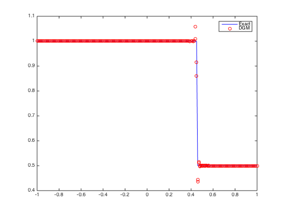
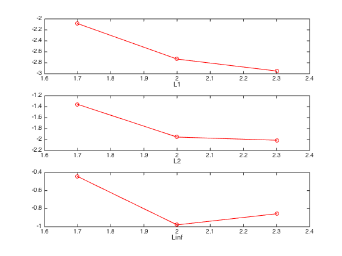
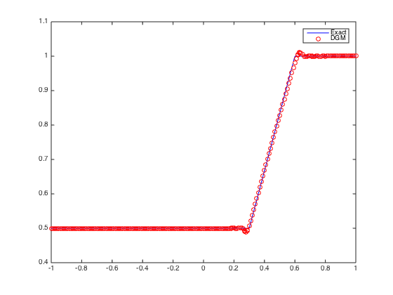
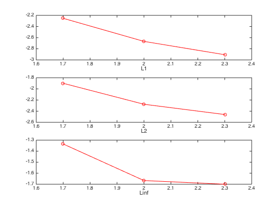

#Discontinuous Galerkin Methods for Burgers equation

#1. Governing Equations
$$\begin{matrix}
u_t + F_x(u) =0 \quad x\in [-1, 1] \cr
u(x,0) = \left\\{
\begin{matrix}
u_L & x<0 \cr
u_R & x>0 \cr
\end{matrix}
\right. 
\end{matrix}$$

---
#2. Discrete with DGM
$$u_h = \sum{l_j u_j} \quad F_h(u) = \sum{l_j F(u_j)}$$
$$\int_{\Omega} l_i l_j \frac{\partial u_j}{\partial t} dx+ 
\int_{\Omega} l_i \frac{\partial l_j}{\partial x} F(u_j) dx= 0$$

$$\int_{\Omega} l_i l_j \frac{\partial u_j}{\partial t} dx + 
\int_{\Omega} l_i \frac{\partial l_j}{\partial x} F(u_j) dx+
\oint_{\partial \Omega} l_i l_j (F^* - F)\cdot \vec{n} ds = 0 $$

$$JM \frac{\partial u}{\partial t} + JMD_x F(u) + J_E M_E (F^* - F)\cdot \vec{n} = 0$$

ODE:
$$\frac{\partial u}{\partial t} = -\frac{\partial r}{\partial x}D_r F(u) + \frac{J_E}{J}M^{-1} M_E (F^* - F)\cdot \vec{n}=L(u(t))$$

$$rhs = -\frac{\partial r}{\partial x}D_r F(u) + \frac{J_E}{J}M^{-1} M_E (F^* - F)\cdot \vec{n}$$

---
#3. Time Stepping
4th order Runge-Kutta

---
#4. Numerical Flux
Godunov Upwind[^1]
$$F^* = \frac{1}{2}(1+sign(\lambda))F^- + \frac{1}{2}(1-sign(\lambda))F^+$$
$$\lambda = \frac{1}{2}(u^- + u^+)$$

[^1]: [1] Khan A A, Lai W. Modeling Shallow Water Flows Using the Discontinuous Galerkin Method[M]. CRC Press, 2014. 50-52

---
#5. Numerical Test
Dam-Break(wet)

| configure | data |
| --- | --- |
| CFL | 0.1 |
| Final Time | 0.6s |

Incrase polynomial and refine mesh size respectively, checking out the L1, L2 and Linf-norm error.

##5.1 Shock Wave

| zone | value |
| --- | --- |
| $u_L$ | 1.0 |
| $u_R$ | 0.5 |

result of 
polynimal order: 1
element num: 200

###5.1.1. Refine mesh size
Polynimal order: 1

| element | L1 | rate | L2 | rate | Linf | rate |
| --- | --- | --- |--- | --- | --- | --- |
| 50 | 0.008242   | ~ | 0.044100  | ~ | 0.360795  | ~ |
| 100 | 0.001851  | 2.1547 | 0.011108  | 1.9892 | 0.104890  | 1.9892 |
| 200 | 0.001121  | 0.7235 | 0.009720  | 0.1926 | 0.139260  | -0.4089 |

###5.1.2. Increase polynimal order
Element num: 100

| order | L1 | L2 | Linf |
| --- | --- | --- |--- |
| 1 | 0.001851  | 0.011108  | 0.104890  |
| 2 | 0.001498  | 0.011510  | 0.145455  |
| 3 | 0.002256  | 0.022295  | 0.365471  |

##5.2 Rarefaction Wave

| zone | value |
| --- | --- |
| $u_L$ | 0.5 |
| $u_R$ | 1.0 |

result of 
polynimal order: 1
element num: 200

###5.2.1. Refine mesh size
Polynimal order: 1

|element |L1   | rate  | L2    | rate  | Linf  | rate  |
| --- | --- | --- |--- | --- | --- | --- |
| 50 | 0.005601 | ~     | 0.012645  | ~     | 0.046397  | ~   |
| 100 | 0.002152 | 1.380006 | 0.005301  | 1.254231  | 0.021544  | 1.106745 |
| 200 | 0.001238 | 0.797667  | 0.003462  | 0.614659  | 0.019960  | 0.110174  |

###5.2.2. Increase polynimal order
Element num: 100

| order | L1 | L2 | Linf |
| --- | --- | --- |--- |
| 1 | 0.002152  | 0.005301  | 0.021544  |
| 2 | 0.001417  | 0.004474  | 0.025473  |
| 3 | Nan  | Nan  | Nan  |

#6. Summary
没有限制器情况下，多项式阶数<=2时最优，增加阶数反而会使数值振荡加剧，从而加大误差。

