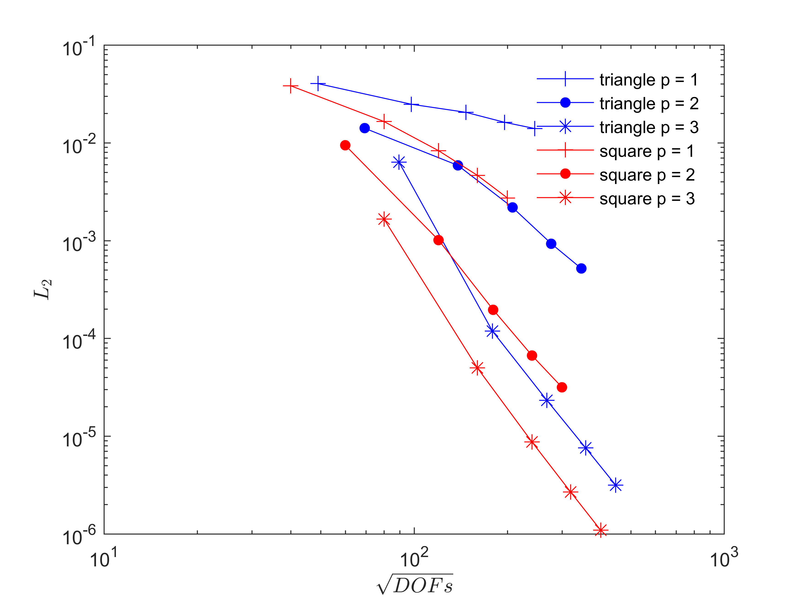
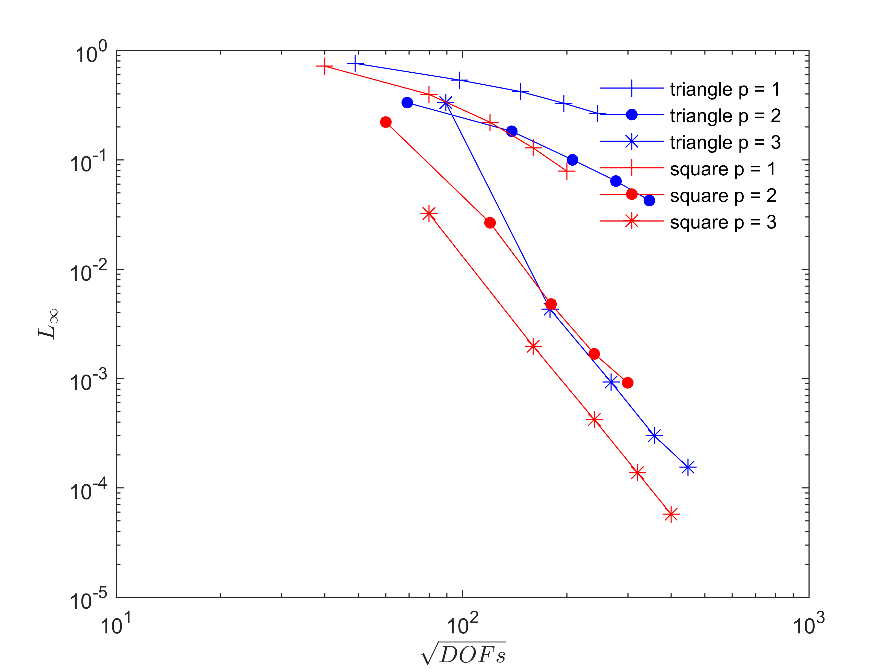

#Slope limiter

#Result

##1. BJ slope limiter everywhere

###1.1. triangle

n = 1

|nele 	|DOFs 	| L2 		| Rate 	| Linf 		| Rate 	|
| --- 	| --- 	| --- 		| ---  | --- 		| --- 	|
|40 	|9600 	|4.99e-02 	|0.00 	|8.25e-01 	|0.00 	|
|60 	|21600 	|4.48e-02 	|0.26 	|8.05e-01 	|0.06 	|
|80 	|38400 	|3.99e-02 	|0.41 	|7.57e-01 	|0.22 	|
|100 	|60000 	|3.51e-02 	|0.57 	|7.00e-01 	|0.35 	|
|Fitted 	|\ 	|\ 	|0.38 	|\ 	|0.17 	|

n = 2

|nele 	|DOFs 	| L2 		| Rate 	| Linf 		| Rate 	|
| --- 	| --- 	| --- 		| ---  | --- 		| --- 	|
|40 	|19200 	|5.01e-02 	|0.00 	|8.92e-01 	|0.00 	|
|60 	|43200 	|4.53e-02 	|0.25 	|8.39e-01 	|0.15 	|
|80 	|76800 	|4.05e-02 	|0.39 	|7.80e-01 	|0.25 	|
|100 	|120000 	|3.58e-02 	|0.54 	|7.19e-01 	|0.36 	|
|Fitted 	|\ 	|\ 	|0.36 	|\ 	|0.23 	|

###1.2. quadrilateral

n = 1

|nele 	|DOFs 	| L2 		| Rate 	| Linf 		| Rate 	|
| --- 	| --- 	| --- 		| ---  | --- 		| --- 	|
|40 	|6400 	|5.47e-02 	|0.00 	|9.55e-01 	|0.00 	|
|60 	|14400 	|5.28e-02 	|0.09 	|9.33e-01 	|0.06 	|
|80 	|25600 	|5.11e-02 	|0.12 	|9.11e-01 	|0.08 	|
|100 	|40000 	|4.94e-02 	|0.15 	|8.91e-01 	|0.10 	|
|Fitted 	|\ 	|\ 	|0.11 	|\ 	|0.07 	|

n = 2

|nele 	|DOFs 	| L2 		| Rate 	| Linf 		| Rate 	|
| --- 	| --- 	| --- 		| ---  | --- 		| --- 	|
|40 	|14400 	|5.47e-02 	|0.00 	|9.55e-01 	|0.00 	|
|60 	|32400 	|5.28e-02 	|0.09 	|9.33e-01 	|0.06 	|
|80 	|57600 	|5.10e-02 	|0.12 	|9.10e-01 	|0.08 	|
|100 	|90000 	|4.93e-02 	|0.15 	|8.89e-01 	|0.11 	|
|Fitted 	|\ 	|\ 	|0.11 	|\ 	|0.08 	|

##2. KXRCF discontinuity detector with BJ slope limiter

###2.1. triangle

n = 1

|nele 	|DOFs 	| L2 		| Rate 	| Linf 		| Rate 	|
| --- 	| --- 	| --- 		| ---  | --- 		| --- 	|
|20 	|2400 	|4.03e-02 	|0.00 	|7.60e-01 	|0.00 	|
|40 	|9600 	|2.48e-02 	|0.70 	|5.35e-01 	|0.51 	|
|60 	|21600 	|2.05e-02 	|0.46 	|4.20e-01 	|0.60 	|
|80 	|38400 	|1.62e-02 	|0.82 	|3.28e-01 	|0.86 	|
|100 	|60000 	|1.40e-02 	|0.67 	|2.66e-01 	|0.95 	|
|Fitted 	|\ 	|\ 	|0.65 	|\ 	|0.64 	|

n = 2

|nele 	|DOFs 	| L2 		| Rate 	| Linf 		| Rate 	|
| --- 	| --- 	| --- 		| ---  | --- 		| --- 	|
|20 	|4800 	|1.41e-02 	|0.00 	|3.32e-01 	|0.00 	|
|40 	|19200 	|7.87e-03 	|0.84 	|1.82e-01 	|0.87 	|
|60 	|43200 	|4.18e-03 	|1.56 	|9.98e-02 	|1.48 	|
|80 	|76800 	|0.93e-03 	|10.68 	|6.39e-02 	|6.85 	|
|100 	|120000 	|5.18e-04 	|-4.42 	|4.24e-02 	|-4.99 	|
|Fitted 	|\ 	|\ 	|2.48 	|\ 	|1.68 	|

n = 3

|nele 	|DOFs 	| L2 		| Rate 	| Linf 		| Rate 	|
| --- 	| --- 	| --- 		| ---  | --- 		| --- 	|
|20 	|8000 	|6.33e-03 	|0.00 	|3.32e-01 	|0.00 	|
|40 	|32000 	|1.19e-04 	|5.73 	|4.29e-03 	|6.27 	|
|60 	|72000 	|2.32e-05 	|4.04 	|9.25e-04 	|3.78 	|
|80 	|128000 	|7.57e-06 	|3.88 	|2.99e-04 	|3.92 	|
|100 	|200000 	|3.15e-06 	|-1.85 	|1.54e-03 	|-7.35 	|
|Fitted 	|\ 	|\ 	|4.17 	|\ 	|3.83 	|

###2.2. quadrilateral

n = 1

|nele 	|DOFs 	| L2 		| Rate 	| Linf 		| Rate 	|
| --- 	| --- 	| --- 		| ---  | --- 		| --- 	|
|20 	|1600 	|3.83e-02 	|0.00 	|7.17e-01 	|0.00 	|
|40 	|6400 	|1.65e-02 	|1.21 	|3.96e-01 	|0.86 	|
|60 	|14400 	|8.30e-03 	|1.69 	|2.20e-01 	|1.45 	|
|80 	|25600 	|4.65e-03 	|2.02 	|1.28e-01 	|1.87 	|
|100 	|40000 	|2.73e-03 	|2.39 	|7.86e-02 	|2.20 	|
|Fitted 	|\ 	|\ 	|1.62 	|\ 	|1.35 	|

n = 2

|nele 	|DOFs 	| L2 		| Rate 	| Linf 		| Rate 	|
| --- 	| --- 	| --- 		| ---  | --- 		| --- 	|
|20 	|3600 	|9.43e-03 	|0.00 	|2.21e-01 	|0.00 	|
|40 	|14400 	|1.01e-03 	|3.22 	|2.65e-02 	|3.06 	|
|60 	|32400 	|1.96e-04 	|4.06 	|4.78e-03 	|4.23 	|
|80 	|57600 	|6.69e-05 	|3.73 	|1.68e-03 	|3.64 	|
|100 	|90000 	|3.16e-05 	|3.36 	|9.11e-04 	|2.73 	|
|Fitted 	|\ 	|\ 	|3.59 	|\ 	|3.50 	|

n = 3

|nele 	|DOFs 	| L2 		| Rate 	| Linf 		| Rate 	|
| --- 	| --- 	| --- 		| ---  | --- 		| --- 	|
|20 	|6400 	|1.66e-03 	|0.00 	|3.21e-02 	|0.00 	|
|40 	|25600 	|4.99e-05 	|5.06 	|1.97e-03 	|4.03 	|
|60 	|57600 	|8.73e-06 	|4.30 	|4.20e-04 	|3.81 	|
|80 	|102400 	|2.68e-06 	|4.10 	|1.37e-04 	|3.88 	|
|100 	|160000 	|1.09e-06 	|4.05 	|5.73e-05 	|3.92 	|
|Fitted 	|\ 	|\ 	|4.55 	|\ 	|3.92 	|

#Reference