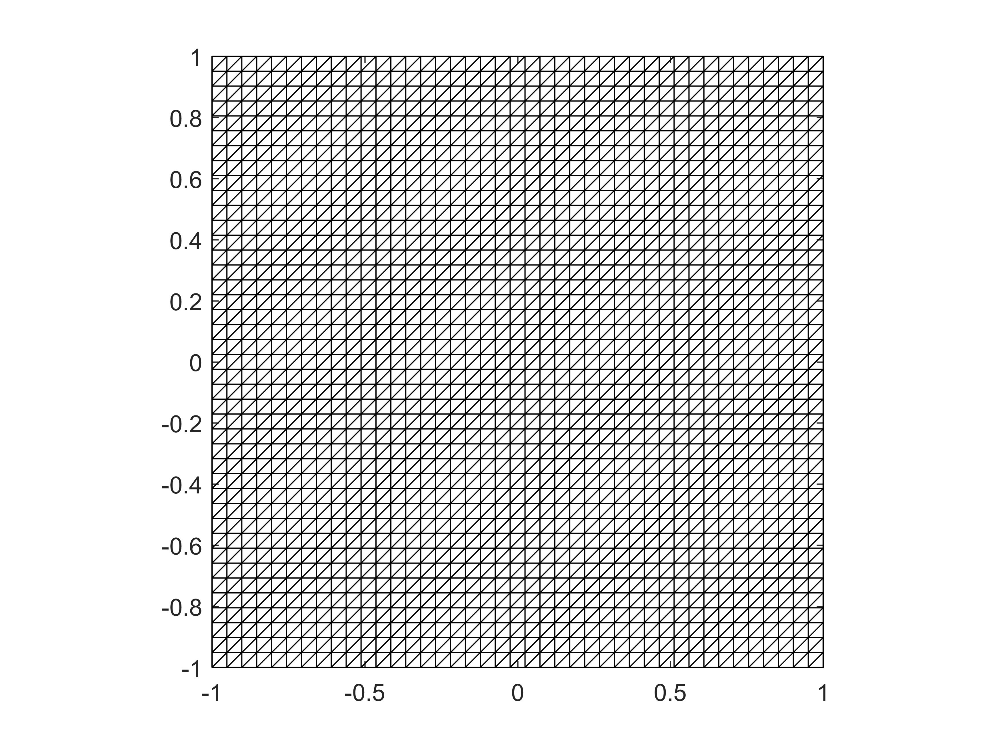
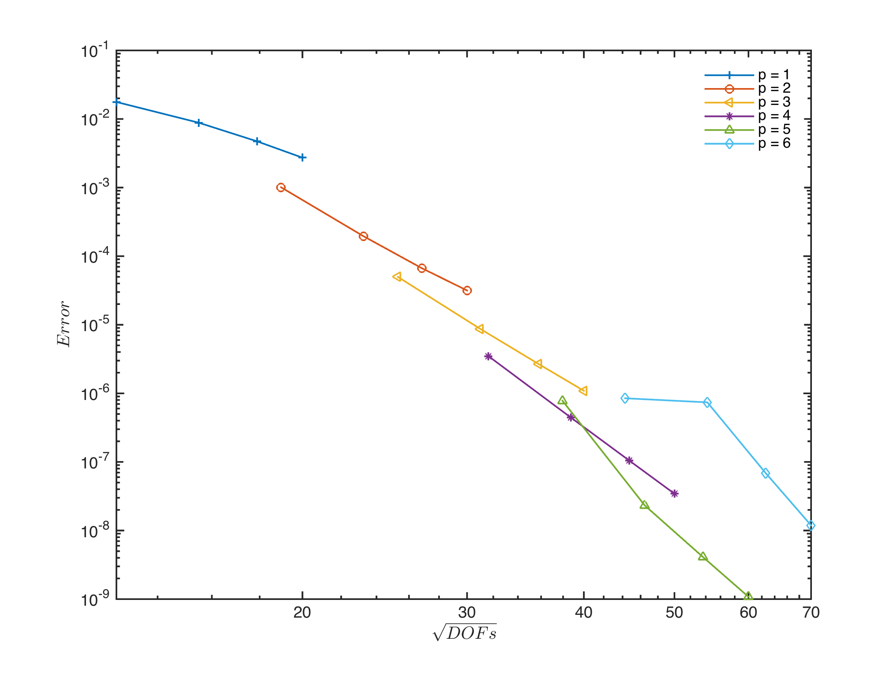
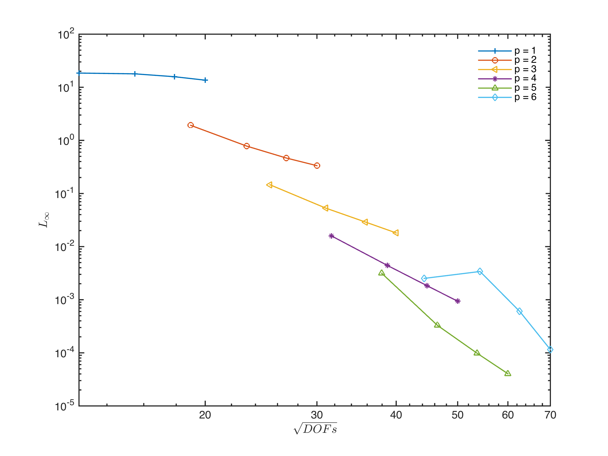

#Introduction

Two dimensional linear transport problem in order to assess the performance of the nodal DG method on triangular elements and on quadrilateral elements.

#Problem description

The governing equation

$$\frac{\partial u}{\partial t} + \nabla \cdot \mathbf{f}(u, x, t) = 0, \quad x\in\Omega$$

where *u* is the scalar variable, the flux term is

$$\mathbf{f} = \mathbf{a}(x) = (a_1(x)u, a_2(x)u).$$

1. computation domain
$[-L, L]$, where $L = 1$.

2. advection velocity
$[a_1, a_2] = (-wy, wx)$, where $w = 5\pi/6$. The advection period is $T = \frac{2\pi}{w} = 2.4$ s.

Figure 1. The constant velocity field $\mathbf{u}$.

3. initial condition
$u(\mathbf{x}, t = 0) = exp\left( -\sigma \left| \mathbf{x} - \mathbf{x}_c \right|^2 \right)$, where $\mathbf{x}_c = (0, 3/5)$, $\sigma = 125 \times 1000/33^2$.

Figure 2. The initial scalar distribution.

4. computation meshes
different resolutions: [20 x 20], [40 x 40], [60 x 60].
different mesh types:
	1. triangle mesh
	2. square mesh
	3. skewed-rectangular mesh

5. boundary condition
transmissive  boundary condition (zero gradient).

Figure 3. Triangle meshes.

Figure 4. Square meshes.

#Result

##1. trangle mesh

|nele 	| DOFs 	| L2		| Rate 	| Linf | Rate |
| --- 	| --- 	| --- 		| --- 	| ---  | ---  |
|40 	| 9600	| 1.56e-02 	|0.00 	| 2.43e+01 	|0.00 	|
|60 	| 21600 | 7.59e-03 	|1.78 	| 2.36e+01 	|0.07 	|
|80 	| 38400 | 4.08e-03 	|2.16 	| 2.10e+01 	|0.39 	|
|100 	| 60000 | 2.41e-03 	|2.36 	| 1.87e+01 	|0.52 	|
|Fitted |\ 		| \ 		| 2.03 	| \ 	|0.28 	|

For high order (p>2), the algorithm needs slope limiter to preserve stability.

|nele 	| DOFs 	| L2		| Rate 	| Linf | Rate |
| --- 	| --- 	| --- 		| --- 	| ---  | ---  |
|40 	| 19200 | 8.27e-02 	|0.00 	| 1.97e+02 	|0.00 	|
|60 	| 43200 | 8.27e-02 	|-0.00 	| 4.43e+02 	|-2.00 	|
|80 	| 76800 | 9.98e+14 	|-128.71| 5.51e+17 	|-120.82|
|100 	| 120000| 4.35e+19 	|-47.87 | 3.02e+22 	|-48.90 |
|Fitted |\ 		|\ 			| -56.87| \ 		|-55.02 |

##2. square mesh

p = 1

|nele 	| DOFs 	| L2		| Rate | Linf 	| Rate |
|---| --- | --- | --- |---| --- | --- |
|40 	| 6400	|1.77e-02 	|0.00 	|1.85e+01 	|0.00 	|
|60 	| 14400	|8.83e-03 	|1.72 	|1.79e+01 	|0.08 	|
|80 	| 25600	|4.72e-03 	|2.18 	|1.58e+01 	|0.43 	|
|100 	| 40000	|2.73e-03 	|2.46 	|1.36e+01 	|0.67 	|
|Fitted | \		|\			|2.03 	|\ 			|0.33 	|

p = 2

|nele 	| DOFs 	| L2		| Rate | Linf 	| Rate |
|---| --- | --- | --- |---| --- | --- |
|40 	| 14400	|1.01e-03 	|0.00 	|1.92e+00 	|0.00 	|
|60 	| 32400	|1.96e-04 	|4.06 	|7.82e-01 	|2.22 	|
|80 	| 57600	|6.69e-05 	|3.73 	|4.66e-01 	|1.80 	|
|100 	| 90000	|3.16e-05 	|3.36 	|3.34e-01 	|1.49 	|
|Fitted | \		|\			|3.80 	|\ 			|1.92 	|

p = 3

|nele 	| DOFs 	| L2		| Rate | Linf 	| Rate |
|---| --- | --- | --- |---| --- | --- |
|40 	| 25600	|4.99e-05 	|0.00 	|1.46e-01 	|0.00 	|
|60 	| 57600	|8.73e-06 	|4.30 	|5.30e-02 	|2.51 	|
|80 	| 102400	|2.68e-06 	|4.10 	|2.90e-02 	|2.09 	|
|100 	| 160000	|1.09e-06 	|4.05 	|1.81e-02 	|2.11 	|
|Fitted | \		|\			|4.18 	|\ 			|2.28 	|

p = 4

|nele 	| DOFs 	| L2		| Rate | Linf 	| Rate |
|---| --- | --- | --- |---| --- | --- |
|40 	| 40000	|3.49e-06 	|0.00 	|1.59e-02 	|0.00 	|
|60 	| 90000	|4.45e-07 	|5.08 	|4.43e-03 	|3.16 	|
|80 	| 160000	|1.05e-07 	|5.02 	|1.84e-03 	|3.05 	|
|100 	| 250000	|3.44e-08 	|4.99 	|9.37e-04 	|3.02 	|
|Fitted | \		|\			|5.04 	|\ 			|3.09 	|

p = 5

|nele 	| DOFs 	| L2		| Rate | Linf 	| Rate |
|---| --- | --- | --- |---| --- | --- |
|40 	| 57600	|7.80e-07 	|0.00 	|3.15e-03 	|0.00 	|
|60 	| 129600	|2.32e-08 	|8.67 	|3.28e-04 	|5.58 	|
|80 	| 230400	|4.08e-09 	|6.04 	|9.80e-05 	|4.20 	|
|100 	| 360000	|1.08e-09 	|5.97 	|4.04e-05 	|3.97 	|
|Fitted | \		|\			|7.17 	|\ 			|4.76 	|

p = 6

|nele 	| DOFs 	| L2		| Rate | Linf 	| Rate |
|---| --- | --- | --- |---| --- | --- |
|40 	| 78400	|8.48e-07 	|0.00 	|2.52e-03 	|0.00 	|
|60 	| 176400	|7.39e-07 	|0.34 	|3.40e-03 	|-0.74 	|
|80 	| 313600	|6.85e-08 	|8.26 	|6.05e-04 	|6.00 	|
|100 	| 490000	|1.19e-08 	|7.85 	|1.15e-04 	|7.45 	|
|Fitted | \		|\			|4.74  	|\ 			|3.35 	|

Figure 5. $\|u - u_h \|_2$ error of square meshes as a function of $\sqrt{DOFs}$ for different orders of p

Figure 6. $\|u - u_h \|_{\infty}$ error of square meshes as a function of $\sqrt{DOFs}$ for different orders of p

##3. Comparation of triangle and square meshes

Figure 7. Comparation of $\|u - u_h \|_2$ error on triangle (blue) and square (red) meshes with the same degree as a function of $\sqrt{DOFs}$ for different orders of p

Figure 8. Comparation of $\|u - u_h \|_{\infty}$ error on triangle (blue) and square (red) meshes with the same degree as a function of $\sqrt{DOFs}$ for different orders of p

#Conclusion

1. For square meshes, the numerical scheme can preserve stability without slope limiter and achieve the optimial order of accuracy (for p < 6).
2. The error of square meshes decrease as DOFs increases. With the same number of DOFs, higher order scheme produce less numerical errors.
3. Square methes produce less error than triangle meshes with the same number of DOFs

In all, the numerical schemes on square meshes has a better performance than on triangle meshes with much less non-physical instability or numerical error.

#Reference

[1] Wirasaet, D., Tanaka, S., Kubatko, E.J., Westerink, J.J., Dawson, C., 2010. A performance comparison of nodal discontinuous Galerkin methods on triangles and quadrilaterals. Int. J. Numer. Meth. Fluids 64, 1336–1362. doi:10.1002/fld.2376

