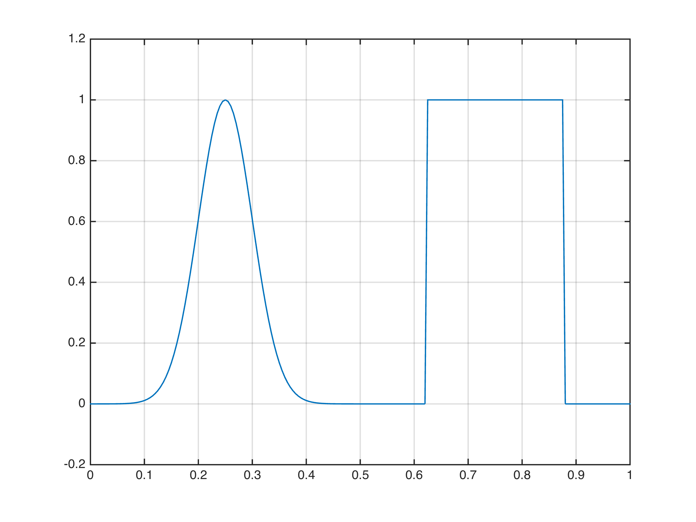
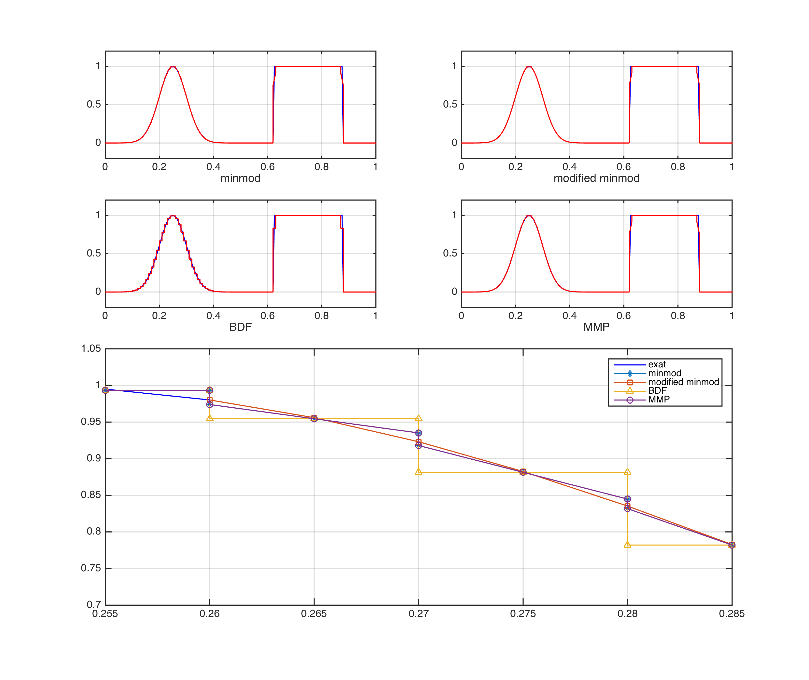

#one dimensional limiter test case

##Limiter Scheme

(Qiu and Shu, 2005; Zhu *et al.*, 2013)

If the approximation of solution is

$$\begin{equation}
u_h(x, t) = \sum_{l = 0}^{k} u_i^{l}(t) v_l^{i}(x) = \sum_{l = 0}^{k} \hat{u}_i^{l}(t) l_l^{i}(x)
\end{equation}$$

where the $\{v_l^{i}(x), l=0,1,\cdots,k\}$ is the orthogonal basis, such as the the scaled Legendre polynomials, and the $\{l_l^{i}(x), l=0,1,\cdots,k\}$ is the nodal basis, such as the Lagrangian interpolation polynomials, $u_i^{l}$ and $\hat{u}_i^{l}(t)$ are coefficients of two basis respectively.

###1. minmod (MD)

Reduce the order of polynomial as linear polynomial

$$\begin{equation}
u_h = \sum_{l = 0}^{1} u_i^{l}(t) v_l^{i}(x) = u_i^{0}(t) v_0^{i}(x) + u_i^{1}(t) v_1^{i}(x)
\end{equation}$$

and the boundary value is written as

$$\begin{equation}
u^{-}_{i+1/2} = u_i^{0} + \tilde{u}_i, \quad u^{+}_{i-1/2} = u_i^{0} - \tilde{\tilde{u}}_i
\end{equation}$$

These are modified by the standard minmod limiter

$$\begin{equation}
\tilde{u}_i^{(mod)} = m\left( \tilde{u}_i, \Delta_+u^0_i, \Delta_-u^0_i \right), \quad
\tilde{\tilde{u}}_i^{(mod)} = m\left( \tilde{\tilde{u}}_i, \Delta_+u^0_i, \Delta_-u^0_i \right)
\end{equation}$$

where the minmod function m is giving by

$$\begin{equation}
m\left( a_1, a_2, \cdots, a_n \right) = \left\{ \begin{matrix}
s \cdot min_{1 \le j \le n} \left| a_j \right| \cr 0
\end{matrix}\right. \quad
\begin{matrix} if \quad sign(a_1)=sign(a_2)=\cdots = sign(a_n)=s \cr otherwise \end{matrix}
\end{equation}$$

or by the TVB-modified minmod function

$$\begin{equation}
\tilde{m}\left( a_1, a_2, \cdots, a_n \right) = \left\{\begin{matrix} a_1 \cr m\left( a_1, a_2, \cdots, a_n \right)
\end{matrix} \right. \quad
\begin{matrix} if \quad |a_1|< Mh^2 \cr otherwise \end{matrix}
\end{equation}$$

###2. modification of minmod limiter (MMD)

The disadvantage of minmod limiter is that it will reduce the result to linear polynomial. The modification method is to make the limit situation less strict.

Firstly, get the modified boundary values with the minmod function.

$$\begin{equation}
u^{-}_{i+1/2} - u_i^{0} = \tilde{u}_i, \quad \tilde{\tilde{u}}_i = u_i^{0} - u^{+}_{i-1/2}
\end{equation}$$

$$\begin{equation}
{u}_{i+1/2}^{(mod)} = u_i^{0} + m\left( \tilde{u}_i, \Delta_+u^0_i, \Delta_-u^0_i \right), \quad
\tilde{\tilde{u}}_{i-1/2}^{(mod)} = u_i^{0} - m\left( \tilde{\tilde{u}}_i, \Delta_+u^0_i, \Delta_-u^0_i \right)
\end{equation}$$

If the modified boundary values is not equales the original value, then the element is reduced to the linear polynomial by minmod limiter.

$$\begin{equation}
\text{if} \quad {u}_{i+1/2}^{(mod)}=u_h(x_{i+1/2}) \quad \text{or} \quad {u}_{i-1/2}^{(mod)}=u_h(x_{i-1/2})
\end{equation}$$

Otherwise, the element keep its high order approximation.

$$\begin{equation}
u_h(x, t) = \sum_{l = 0}^{k} u_i^{l}(t) v_l^{i}(x)
\end{equation}$$

###3. moment limiter of Biswas (BDF)

The moment-based limiter in is given by

$$\begin{equation}
u_i^{(l),mod} = \frac{1}{2l-1}m\left( \left(2l-1 \right)u_i^{(l)}, u_{i+1}^{(l-1)} - u_{i}^{(l-1)}, u_{i}^{(l-1)} - u_{i-1}^{(l-1)} \right)
\end{equation}$$

where m is again the minmod function

First, the highest-order moment $u_i^k$ is limited. Then the limiter is applied to successively lower-order moments when the next higher-order moment on the interval has been changed by the limiting.

**Warnning: error exits with BDF limiter source code**

###4. modification of moment limiter by Burbeau

###5. modification of the MP limiter (MMP)

As a troubled-cell indicator, the MMP limiter can be described as follows:

$$\begin{equation}
\varphi = min\left(1，\Delta\bar{u}^{min}/\Delta_{min} u \right)
\end{equation}$$

where

$$\begin{equation}
\Delta\bar{u}^{min} = u_i^0- min\left( u_{i-1}^0, u_{i}^0,u_{i+1}^0 \right) \quad \Delta_{min} u = u_i^0 - min(u_{i-1/2}^+, u_{i+1/2}^-)
\end{equation}$$

When $\varphi \ne 1$, the limiter, such as minmod limiter, acts on the cell.

###6. Krivodonova's shock detector

**Warnning: question exits with Krivodonova indector method**

##Source Code

##Test case$^{[3]}$

For the test case, please refered to Davidovits (2012)[3] for more details.

The computational grid is [0, 1], and subdivided into 200 element, which is of second order accuracy.

The initial condition consists of two parts: a continuous function and a step function.

$$\begin{eqnarray}
\begin{aligned}
& f_1 = exp\left( -\frac{(x - x_0)^2}{D_x} \right) \quad D_x = \frac{(x_2 - x_1)^2}{200} \cr
& f_2 = \left\{ \begin{matrix}
1 \cr 0
\end{matrix} \right. \quad
\begin{matrix}
0.625 \le x \le 0.875 \cr otherwise
\end{matrix}
\end{aligned}
\end{eqnarray}$$

The limiter function is applied on the scalar field $N$ times ($N$ is the iteration number), then get the final results. This situation equivalent to the advection problem with no-flow situation.

##Results

|method |	 L1 |	 L2 |
| --- | --- | --- |
|minmod |	 0.750000 |	 0.063141 |
|modified minmod |	 0.750000 |	 0.063111 |
|BDF |	 0.833333 |	 0.072763 |
|MMP |	 0.750000 |	 0.063141 |

##Reference

1. QIU J, SHU C W，. A Comparison of Troubled-Cell Indicators for Runge--Kutta Discontinuous Galerkin Methods Using Weighted Essentially Nonoscillatory Limiters[J]. SIAM Journal on Scientific Computing, 2005.
2. Zhu H, Cheng Y, Qiu J. A comparison of the performance of limiters for Runge-Kutta discontinuous Galerkin methods[J]. Advances in Applied Mathematics and Mechanics, 2013, 5(03): 365-390.
3. Davidovits S, Hakim A, Hammett G. Tests of Limiters for Discontinuous Galerkin Advection Algorithms[J]. Bulletin of the American Physical Society, 2012, 57.
