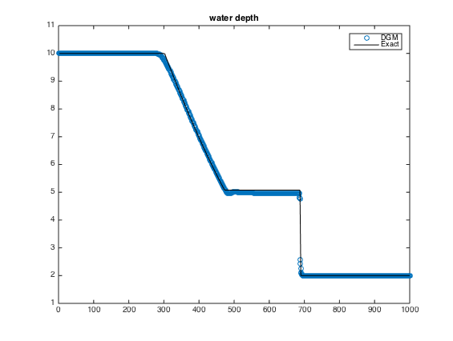
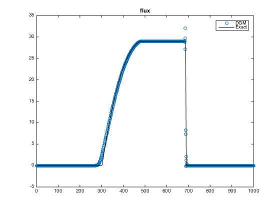

#RKDG to shallow water equations

##1.Governing Equations
$$\frac{\partial U}{\partial t} + \frac{\partial F}{\partial x} = 0$$
$$U = \begin{bmatrix} h \cr q \end{bmatrix} \quad
F = \begin{bmatrix} q \cr gh^2/2 + q^2/h \end{bmatrix}$$

##2.Discrete with DGM

$$\begin{equation} U_h = \sum{l_j U_j} \quad F_h(U) = \sum{l_j F(U_j)} \end{equation}$$

$$\begin{equation}\int_{\Omega} l_i l_j \frac{\partial U_j}{\partial t} dx+
\int_{\Omega} l_i \frac{\partial l_j}{\partial x} F(U_j) dx= 0 \end{equation}$$

$$\begin{equation} \int_{\Omega} l_i l_j \frac{\partial U_j}{\partial t} dx +
\int_{\Omega} l_i \frac{\partial l_j}{\partial x} F(U_j) dx+
\oint_{\partial \Omega} l_i l_j (F^* - F)\cdot \vec{n} ds = 0  \end{equation}$$

$$\begin{equation} JM \frac{\partial U}{\partial t} + JMD_x F(U) + J_E M_E (F^* - F)\cdot \vec{n} = 0 \end{equation}$$

ODE:
$$\begin{equation} \frac{\partial U}{\partial t} = -\frac{\partial r}{\partial x}D_r F(U) + \frac{J_E}{J}M^{-1} M_E (F^* - F)\cdot \vec{n}=L(U(t)) \end{equation}$$

$$\begin{equation} rhs = -\frac{\partial r}{\partial x}D_r F(U) + \frac{J_E}{J}M^{-1} M_E (F - F^*)\cdot \vec{n}\end{equation} $$

##3.Numerical Flux
###3.1.HLL flux function

$$F^{HLL} = \left\{ \begin{matrix}
F^- \cr
\frac{S_R F^- - S_L F^+ + S_L S_R(U^+ - U^-)}{S_R S_L} \cr
F^+ \end{matrix} \right.
\begin{matrix}
S_L \geq 0 \cr
S_L < 0 < S_R \cr
S_R \leq 0
\end{matrix}$$

Wave Speed is suggested by Fraccarollo and Toro (1995)

$$ S_L = min(u^- - \sqrt{gh^-}, u^* - c^*)$$

$$ S_R = min(u^+ + \sqrt{gh^+}, u^* + c^*)$$

$u^*$ and $c^*$ is defined by

$$u^* = \frac{1}{2}(u^- + u^+) + \sqrt{gh^-} - \sqrt{gh^+}$$

$$c^* = \frac{1}{2}(\sqrt{gh^-} + \sqrt{gh^+}) + \frac{1}{4}(u^- - u^+)$$

###3.2.Rotational invariance

$$T = \begin{bmatrix} 1 & 0 \cr
0 & n_x\end{bmatrix} \quad
T^{-1} = \begin{bmatrix} 1 & 0 \cr
0 & n_x\end{bmatrix}$$

$$\mathbf{F} \cdot \mathbf{n} = \mathbf{F} \cdot n_x = T^{-1}\mathbf{F}(TU)$$

defining $Q = TU$, the numerical flux $\hat{\mathbf{F}}$ can be obtained through the evaluation of numerical flux $\mathbf{F}$ by

$$\hat{\mathbf{F}} \cdot n = T^{-1}\mathbf{F}(Q)$$

###3.2.Rotational Invariance

The rotation matrix and its inverse is giving as:

$$\begin{equation}
T = \begin{bmatrix}
1 & 0 \cr
0 & n_x \end{bmatrix} \quad
T^{-1} = \begin{bmatrix}
1 & 0 \cr
0 & n_x \end{bmatrix}
\end{equation}$$

The rotational invariance of the flux yields

$$\begin{equation}
\mathbf{F} \cdot \mathbf{n} = \mathbf{F} \cdot n_x = T^{-1} \mathbf{F} (TU)
\end{equation}$$

#4.Limiter

minmod limiter

[TBC]

#5.Numerical Test

##5.1.Ideal dam break

| Model Setting | value |
| --- | --- |
| channel length | 1000m |
| dam position | 500m |
| upstream h | 10m |
| downstream h | 2m |
| element num | 400 |
| Final Time | 20s |

