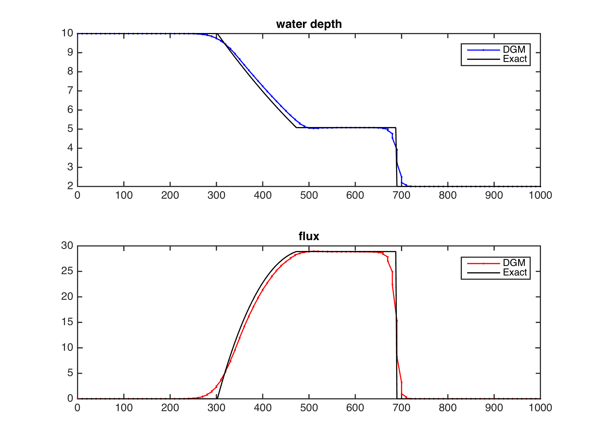
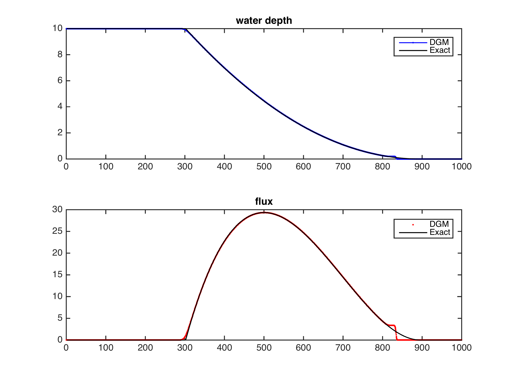
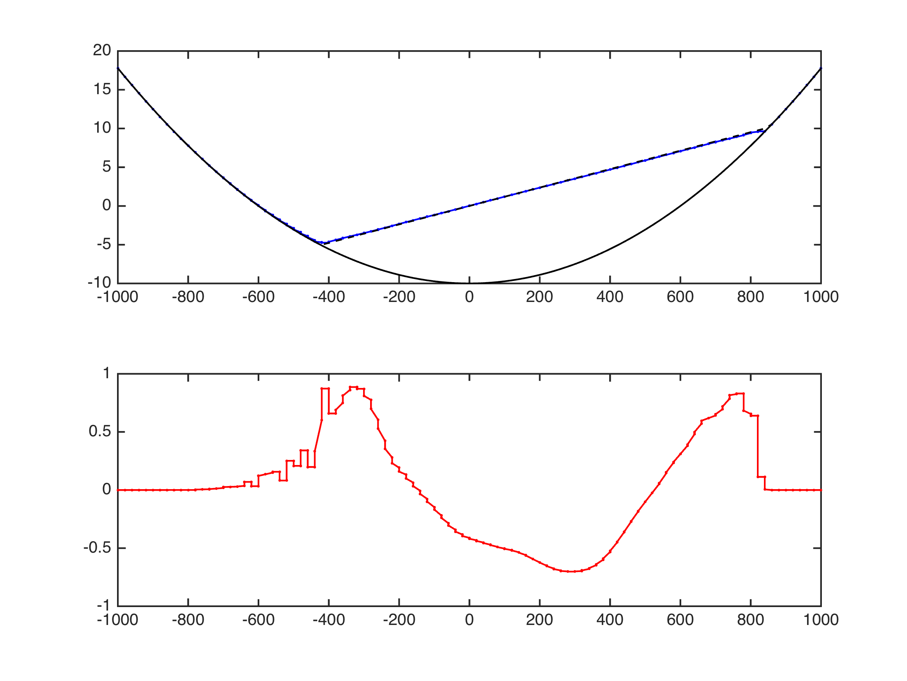
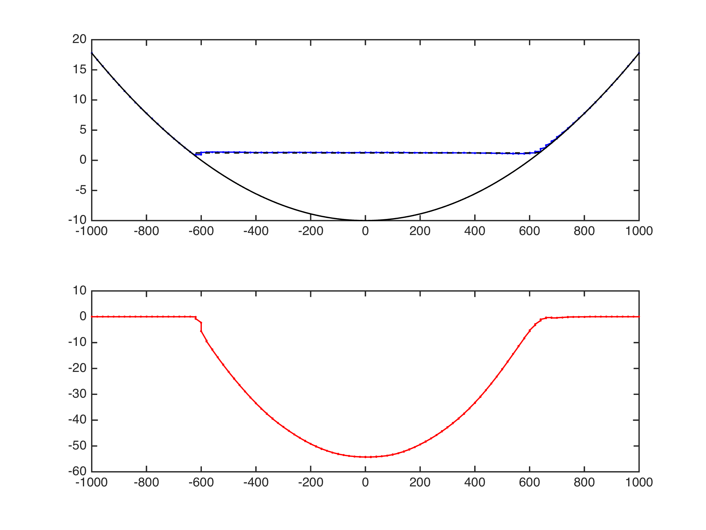
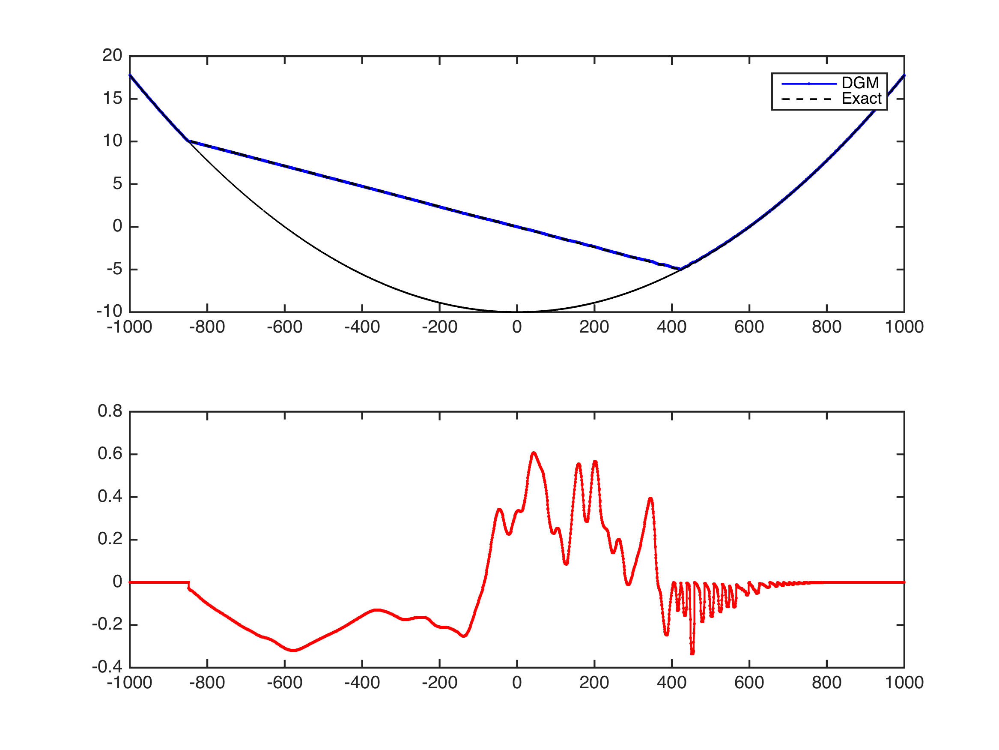
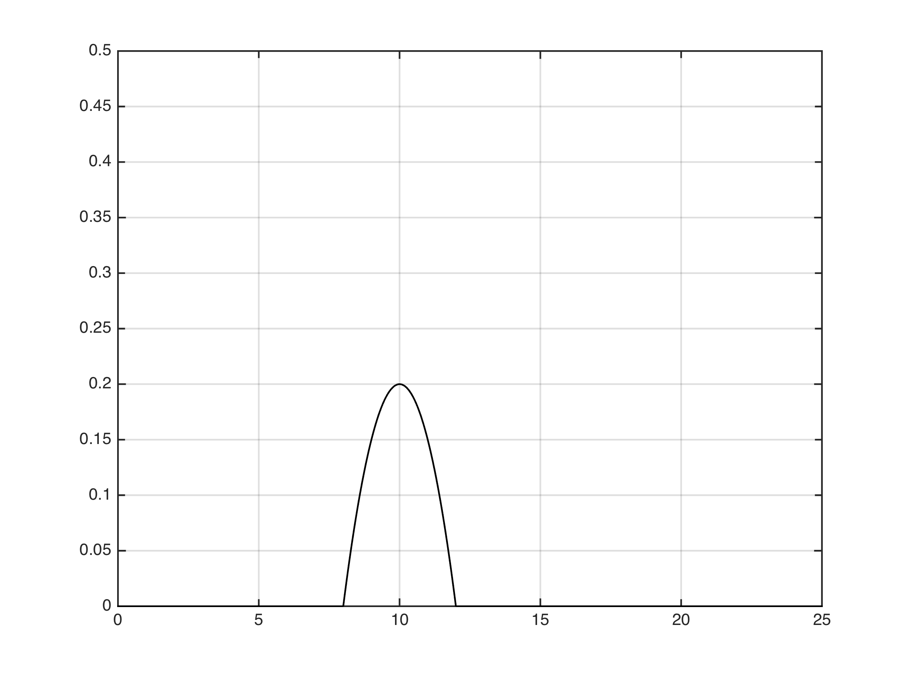

#RKDG to shallow water equations

##1.Governing Equations
$$\begin{equation}
\frac{\partial U}{\partial t} + \frac{\partial F(U)}{\partial x} = S(U)
\end{equation}$$

$$\begin{equation}
U = \begin{bmatrix}\eta \cr q_x \end{bmatrix} \quad F = \begin{bmatrix}q_x \cr \frac{q_x^2}{h} + \frac{1}{2}g(\eta^2 - 2\eta z) \end{bmatrix} \quad S = \begin{bmatrix}0 \cr -g\eta\frac{\partial z}{\partial x} \end{bmatrix}
\end{equation}$$

##2.Discrete with DGM

$$\begin{equation} U_h = \sum{l_j U_j} \quad F_h(U) = \sum{l_j F(U_j)} \end{equation}$$


$$\begin{equation}\int_{\Omega} l_i l_j \frac{\partial U_j}{\partial t} dx+
\int_{\Omega} l_i \frac{\partial l_j}{\partial x} F(U_j) dx= 0 \end{equation}$$


$$\begin{equation} \int_{\Omega} l_i l_j \frac{\partial U_j}{\partial t} dx +
\int_{\Omega} l_i \frac{\partial l_j}{\partial x} F(U_j) dx+
\oint_{\partial \Omega} l_i l_j (F^* - F)\cdot \vec{n} ds = 0  \end{equation}$$

$$\begin{equation} JM \frac{\partial U}{\partial t} + JMD_x F(U) + J_E M_E (F^* - F)\cdot \vec{n} = 0 \end{equation}$$

ODE:
$$\begin{equation} \frac{\partial U}{\partial t} = -\frac{\partial r}{\partial x}D_r F(U) + \frac{J_E}{J}M^{-1} M_E (F^* - F)\cdot \vec{n}=L(U(t)) \end{equation}$$

$$\begin{equation} rhs = -\frac{\partial r}{\partial x}D_r F(U) + \frac{J_E}{J}M^{-1} M_E (F - F^*)\cdot \vec{n}\end{equation} $$

It is important to point out that at dry cells no flux is flow inside the elemnt. Therefor, for dry cells

$$\begin{equation} rhs = \frac{J_E}{J}M^{-1} M_E (F - F^*)\cdot \vec{n}\end{equation} $$

##3.Numerical Flux
###3.1.HLL flux function

Formulations are given as

$$F^{HLL} = \left\{ \begin{matrix}
F^- \cr
\frac{S_R F^- - S_L F^+ + S_L S_R(U^+ - U^-)}{S_R S_L} \cr
F^+ \end{matrix} \right.
\begin{matrix}
S_L \geq 0 \cr
S_L < 0 < S_R \cr
S_R \leq 0
\end{matrix}$$

Wave Speed is suggested by Fraccarollo and Toro (1995)

$$ S_L = min(u^- - \sqrt{gh^-}, u^* - c^*)$$

$$ S_R = min(u^+ + \sqrt{gh^+}, u^* + c^*)$$

$u^*$ and $c^*$ is defined by

$$u^* = \frac{1}{2}(u^- + u^+) + \sqrt{gh^-} - \sqrt{gh^+}$$

$$c^* = \frac{1}{2}(\sqrt{gh^-} + \sqrt{gh^+}) + \frac{1}{4}(u^- - u^+)$$

for wet-dry interface, the wave speed is giving as

1. left-hand dry bed
$$\begin{equation}
S_L = u^+ - 2\sqrt{g h^+} \quad S_R = u^+ + \sqrt{g h^+}
\end{equation}$$

2. right-hand dry bed
$$\begin{equation}
S_L = u^- - \sqrt{g h^-} \quad S_R = u^- + 2\sqrt{g h^-}
\end{equation}$$

3. both sides are dry
$$\begin{equation}
S_L = 0 \quad S_R = 0
\end{equation}$$

**Noticing. 1**
For flux terms, the discharge $q^2$ is divided by water depth $h$
$$F = \begin{bmatrix} q \cr gh^2/2 + q^2/h \end{bmatrix}$$

so a threadhold of water depth $h_{flux}$ ( $10^{-3}$m ) is add into flux function `SWEFlux.m`. When $h$ is less than $h_{flux}$, the $q^2/h$ is approximated to 0 as there is no flow at this node.

**Noticing. 2**
When defining the dry beds, another threadhold of water depth $h_{dry}$ is used. It is convenient to deine $h_{dry}$ equals to $h_{flux}$.

###3.2.Rotational invariance

$$T = \begin{bmatrix} 1 & 0 \cr
0 & n_x\end{bmatrix} \quad
T^{-1} = \begin{bmatrix} 1 & 0 \cr
0 & n_x\end{bmatrix}$$

$$\mathbf{F} \cdot \mathbf{n} = \mathbf{F} \cdot n_x = T^{-1}\mathbf{F}(TU)$$

defining $Q = TU$, the numerical flux $\hat{\mathbf{F}}$ can be obtained through the evaluation of numerical flux $\mathbf{F}$ by

$$\hat{\mathbf{F}} \cdot n = T^{-1}\mathbf{F}^{HLL}(Q)$$


##4.Limiter
**Note: discontinuity detector from Krivodonova (2003) is not working**

For better numerical stability, minmod limiter is used in limiting the discharge and elevation.

Check `testing/Limiter1D/doc` for more details about minmod limiter.

##5. Positive preserving limiter

For the thin layer approach, a small depth ( $h_{positive} = 10^{-3} m$) and zeros velocity are prescribed for dry nodes.

The first step is to define wet elements. After each time step, **the whole domain** is calculated; If the any depth of nodes in $\Omega_i$ is greater than $h_{positive}$, then the element is defined as wet element, otherwise the water height of all nodes are remain unchanged.

The second step is to modify wet cells; If the depth of any nodes is less than $h_{positive}$, then the flow rate is reset to zero and the new water depth is constructed as

$$\begin{equation}
\begin{array}{c}
\mathrm{M}\Pi_h h_i(x) = \theta_1 \left( h_i(x) - \bar{h}_i \right) + \bar{h}_i \cr
\mathrm{M}\Pi_h q_i(x) = \theta_1 \left( q_i(x) - \bar{q}_i \right) + \bar{q}_i \cr
\end{array}
\end{equation}$$

where

$$\begin{equation}
\theta_1 = min \left\{ \frac{\bar{h}_i - \xi }{\bar{h}_i - h_{min}}, 1 \right\}, \quad h_{min} = min\{ h_i (x_i) \}
\end{equation}$$

It is necessary to fulfill the restriction that the mean depth $\bar{h}_i$ is greater than $\xi$, i.e. $0$ m. In the function `PositiveOperator`, if the mean depth of element is less than $\xi$, all nodes will add a small depth $\xi - \bar{h}_i$ to re-fulfill the restriction. At last, all nodes with negative water depth $h_i(x_j) < 0$ will be modified to zero.

##6. Wet/Dry treatment

###6.1. Identification of dry cells

`WetDryJudge.m`

```
function isWet = WetDryJudge(mesh, h, physics)
```

###6.2. Cancellation of gravity


##7.Numerical Test

###7.1.Wet dam break

| Model Setting | value |
| --- | --- |
| channel length | 1000m |
| dam position | 500m |
| upstream depth | 10m |
| downstream depth | 2m |
| element num | 400 |
| Final Time | 20s |



###7.2.Dry dam break

| Model Setting | value |
| --- | --- |
| channel length | 1000m |
| dam position | 500m |
| upstream depth | 10m |
| downstream depth | 0m |
| element num | 400 |
| Final Time | 20s |

The analytical solution from Izem et al. (2016)

$$\begin{eqnarray}
\begin{aligned}
h_1(x,t) = \left\{ \begin{matrix}
h_0, & \text{if} \quad x\le -t \sqrt{gh_0}, \cr
\frac{1}{9g}\left( 2 \sqrt{gh_0} - \frac{x}{t} \right)^2, & \text{if} \quad -t\sqrt{gh_0}\le x\le2t \sqrt{gh_0}, \cr
0, & \text{if} \quad x> 2t\sqrt{gh_0}
\end{matrix} \right.
\end{aligned}
\end{eqnarray}$$

$$\begin{eqnarray}
\begin{aligned}
u_1(x,t) = \left\{ \begin{matrix}
0, & \text{if} \quad x\le -t \sqrt{gh_0}, \cr
\frac{2}{3}\left( \sqrt{gh_0} + \frac{x}{t} \right)^2, & \text{if} \quad -t\sqrt{gh_0}\le x\le2t \sqrt{gh_0}, \cr
0, & \text{if} \quad x> 2t\sqrt{gh_0}
\end{matrix} \right.
\end{aligned}
\end{eqnarray}$$



###7.3.Parabolic bowl

| Model Setting | value |
| --- | --- |
| channel length | 2000m |
| $h_0$ | 10m |
| $a$ | 600m |
| $B$ | 5m/s |
| $T$ | 269s |

Exact solution

$$\begin{equation}
Z(x,t) = \frac{-B^2 \mathrm{cos}(2wt) - B^2 - 4Bw \mathrm{cos}(wt)x}{4g}
\end{equation}$$

1. $t = T/2$


2. $t = 3T/4$


2. $t = T$


Accuracy

$h_0$ = 1.000000e-16

1. rate of h
|nele, 	| L2, 			| Rate, 		| Linf, 		 | Rate|
| --- | --- | --- | --- | --- |
|50, 	|8.800119e-03, 	|0.000000,	|4.372333e-02,	|0.000000|
|100, 	|3.292498e-03, 	|1.418341,	|2.163071e-02,	|1.015322|
|200, 	|1.288988e-03, 	|1.352943,	|1.085259e-02,	|0.995042|
|400, 	|4.924646e-04, 	|1.388147,	|5.641736e-03,	|0.943828|
|600, 	|4.544066e-04, 	|0.198365,	|4.161074e-03,	|0.750789|
|800, 	|3.203419e-04, 	|1.215242,	|3.245779e-03,	|0.863515|
|1000, 	|2.411965e-04, 	|1.271724,	|2.662130e-03,	|0.888348|
|Fitted, 	|\ 			|1.177655, 	|\ 			|0.929671|

2. rate of q
|nele, 	| L2, 			| Rate, 		| Linf, 		 | Rate|
| --- | --- | --- | --- | --- |
|50, 	|6.217180e-02, 	|0.000000,	|2.794405e-01,	|0.000000|
|100, 	|1.894557e-02, 	|1.714400,	|1.329985e-01,	|1.071132|
|200, 	|7.092668e-03, 	|1.417460,	|6.453923e-02,	|1.043161|
|400, 	|2.613210e-03, 	|1.440505,	|3.437918e-02,	|0.908641|
|600, 	|2.150130e-03, 	|0.481055,	|2.200144e-02,	|1.100818|
|800, 	|1.525695e-03, 	|1.192561,	|1.687967e-02,	|0.921148|
|1000, 	|1.154507e-03, 	|1.249313,	|1.370871e-02,	|0.932489|
|Fitted, 	|\ 			|1.300066, 	|\ 			|1.002477|

$h_0$ = 1.000000e-08

1. rate of h
|nele, 	| L2, 			| Rate, 		| Linf, 		 | Rate|
| --- | --- | --- | --- | --- |
|50, 	|8.600687e-03, 	|0.000000,	|4.192890e-02,	|0.000000|
|100, 	|3.175161e-03, 	|1.437622,	|2.004072e-02,	|1.065011|
|200, 	|1.239785e-03, 	|1.356740,	|1.071337e-02,	|0.903523|
|400, 	|4.876428e-04, 	|1.346193,	|5.640703e-03,	|0.925465|
|600, 	|4.544081e-04, 	|0.174090,	|4.161074e-03,	|0.750337|
|800, 	|3.201362e-04, 	|1.217487,	|3.245777e-03,	|0.863517|
|1000, 	|2.411816e-04, 	|1.269123,	|2.662127e-03,	|0.888349|
|Fitted, 	|\ 			|1.165586, 	|\ 			|0.908265|

2. rate of q
|nele, 	| L2, 			| Rate, 		| Linf, 		 | Rate|
| --- | --- | --- | --- | --- |
|50, 	|6.449279e-02, 	|0.000000,	|2.927116e-01,	|0.000000|
|100, 	|2.100402e-02, 	|1.618472,	|1.423454e-01,	|1.040084|
|200, 	|7.225224e-03, 	|1.539551,	|6.552083e-02,	|1.119371|
|400, 	|2.607891e-03, 	|1.470159,	|3.437919e-02,	|0.930418|
|600, 	|2.150136e-03, 	|0.476023,	|2.200146e-02,	|1.100817|
|800, 	|1.525435e-03, 	|1.193162,	|1.687969e-02,	|0.921147|
|1000, 	|1.154481e-03, 	|1.248653,	|1.370872e-02,	|0.932488|
|Fitted, 	|\ 			|1.324473, 	|\ 			|1.023851|

$h_0$ = 1.000000e-04
1. rate of h
|nele, 	| L2, 			| Rate, 		| Linf, 		 | Rate|
| --- | --- | --- | --- | --- |
|50, 	|8.643724e-03, 	|0.000000,	|4.511939e-02,	|0.000000|
|100, 	|3.188075e-03, 	|1.438967,	|2.076523e-02,	|1.119578|
|200, 	|1.239844e-03, 	|1.362527,	|1.070841e-02,	|0.955426|
|400, 	|4.876315e-04, 	|1.346295,	|5.628253e-03,	|0.927985|
|600, 	|4.547209e-04, 	|0.172336,	|4.141298e-03,	|0.756637|
|800, 	|3.204048e-04, 	|1.216964,	|3.225659e-03,	|0.868569|
|1000, 	|2.414560e-04, 	|1.267784,	|2.635827e-03,	|0.904981|
|Fitted, 	|\ 			|1.166982, 	|\ 			|0.933501|
2. rate of q
|nele, 	| L2, 			| Rate, 		| Linf, 		 | Rate|
| --- | --- | --- | --- | --- |
|50, 	|6.031060e-02, 	|0.000000,	|2.792178e-01,	|0.000000|
|100, 	|1.920369e-02, 	|1.651028,	|1.352682e-01,	|1.045568|
|200, 	|7.226679e-03, 	|1.409979,	|6.562673e-02,	|1.043467|
|400, 	|2.609933e-03, 	|1.469320,	|3.450745e-02,	|0.927376|
|600, 	|2.153471e-03, 	|0.474130,	|2.208475e-02,	|1.100681|
|800, 	|1.529577e-03, 	|1.189124,	|1.698832e-02,	|0.911985|
|1000, 	|1.158921e-03, 	|1.243602,	|1.382198e-02,	|0.924363|
|Fitted, 	|\ 			|1.294776, 	|\ 			|1.002877|

$h_0$ = 1.000000e-02
1. rate of h
|nele, 	| L2, 			| Rate, 		| Linf, 		 | Rate|
| --- | --- | --- | --- | --- |
|50, 	|8.608271e-03, 	|0.000000,	|4.408748e-02,	|0.000000|
|100, 	|3.158433e-03, 	|1.446514,	|2.009261e-02,	|1.133704|
|200, 	|1.258587e-03, 	|1.327404,	|1.194508e-02,	|0.750249|
|400, 	|6.003156e-04, 	|1.068012,	|8.521890e-03,	|0.487171|
|600, 	|6.529236e-04, 	|-0.207181,	|7.860621e-03,	|0.199209|
|800, 	|5.888363e-04, 	|0.359118,	|9.859407e-03,	|-0.787538|
|1000, 	|5.633175e-04, 	|0.198548,	|1.083976e-02,	|-0.424816|
|Fitted, 	|\ 			|0.905315, 	|\ 			|0.475090|
2. rate of q
|nele, 	| L2, 			| Rate, 		| Linf, 		 | Rate|
| --- | --- | --- | --- | --- |
|50, 	|5.940228e-02, 	|0.000000,	|2.791425e-01,	|0.000000|
|100, 	|1.914396e-02, 	|1.633629,	|1.375647e-01,	|1.020891|
|200, 	|7.514171e-03, 	|1.349204,	|7.471690e-02,	|0.880604|
|400, 	|3.761533e-03, 	|0.998293,	|5.533398e-02,	|0.433269|
|600, 	|3.884115e-03, 	|-0.079091,	|4.860838e-02,	|0.319612|
|800, 	|3.622466e-03, 	|0.242421,	|6.056319e-02,	|-0.764356|
|1000, 	|3.523392e-03, 	|0.124274,	|6.236136e-02,	|-0.131120|
|Fitted, 	|\ 			|0.928351, 	|\ 			|0.506365|

$h_0$ = 1
1. rate of h
|nele, 	| L2, 			| Rate, 		| Linf, 		 | Rate|
| --- | --- | --- | --- | --- |
|50, 	|2.708511e-02, 	|0.000000,	|1.283549e-01,	|0.000000|
|100, 	|3.434310e-02, 	|-0.342520,	|1.558255e-01,	|-0.279793|
|200, 	|4.028671e-02, 	|-0.230283,	|1.855978e-01,	|-0.252249|
|400, 	|4.356289e-02, 	|-0.112796,	|1.894851e-01,	|-0.029905|
|600, 	|4.481316e-02, 	|-0.069787,	|1.894851e-01,	|0.000000|
|800, 	|4.533018e-02, 	|-0.039875,	|1.969701e-01,	|-0.134668|
|1000, 	|4.565744e-02, 	|-0.032237,	|1.954759e-01,	|0.034126|
|Fitted, 	|\ 			|-0.165078, 	|\ 			|-0.130615|
2. rate of q
|nele, 	| L2, 			| Rate, 		| Linf, 		 | Rate|
| --- | --- | --- | --- | --- |
|50, 	|2.211821e-01, 	|0.000000,	|7.987508e-01,	|0.000000|
|100, 	|2.367326e-01, 	|-0.098024,	|9.242281e-01,	|-0.210503|
|200, 	|2.646718e-01, 	|-0.160946,	|9.445411e-01,	|-0.031365|
|400, 	|2.866632e-01, 	|-0.115153,	|1.068557e+00,	|-0.177979|
|600, 	|2.946276e-01, 	|-0.067587,	|1.109569e+00,	|-0.092886|
|800, 	|2.990616e-01, 	|-0.051923,	|1.167884e+00,	|-0.178050|
|1000, 	|3.009843e-01, 	|-0.028720,	|1.180302e+00,	|-0.047398|
|Fitted, 	|\ 			|-0.108392, 	|\ 			|-0.126778|

###7.4.Flow over dump



1. subcritical flow
| Model Setting | value |
| --- | --- |
| channel length | 25m |
| $h_0$ | 0.5m |
| $q_0$ | 0.18m2/s |
| $T$ | 200s |

2. supercritical flow
| Model Setting | value |
| --- | --- |
| channel length | 25m |
| $h_0$ | 2.0m |
| $q_0$ | 25.0567m2/s |
| $T$ | 200s |

3. transcritical flow
| Model Setting | value |
| --- | --- |
| channel length | 25m |
| $h_0$ | 0.33m |
| $q_0$ | 0.18m2/s |
| $T$ | 200s |

###7.5.Lake at rest
| Model Setting | value |
| --- | --- |
| domain | 0~1m |
| $h_0$ | 1.0m |
| $q_0$ | 0.0m2/s |
| $T$ | 20 |

bottom topography

$$\begin{equation}
b_s(x) = b(r) = \left\{ \begin{matrix}
a \cdot \frac{exp(-0.5/(r_m^2 - r^2))}{exp(-0.5/r_m^2)} & \text{if} \quad r\le r_m \cr
0 & \text{otherwise}
\end{matrix} \right.
\end{equation}$$

where $r = \left| x - 0.5 \right|$， $r_m = 0.4$ and $a = 1.2$

water depth at $T=0$s
$$\begin{equation}
h_0 = min(0, 1- b(x))
\end{equation}$$

##8. Todo List

*16/4/21 - simplification of `Hrefine1D.m`*
In `Hrefine1D.m`, avoid of calling `RegionLine.BuildMap`, modified `vmapM` and `vmapP` in an other way.

*Done - 16/4/21, "optimization of Hrefine1D"*

*16/4/29 - reconstruct the wet/dry judgement*
Use one function to judege the wet/dry status of cells and store it in variable `isWet`. Use the same threshold value in calculating the wet/dry status in RHS, flux terms, slope limiter.


